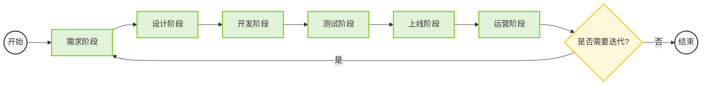
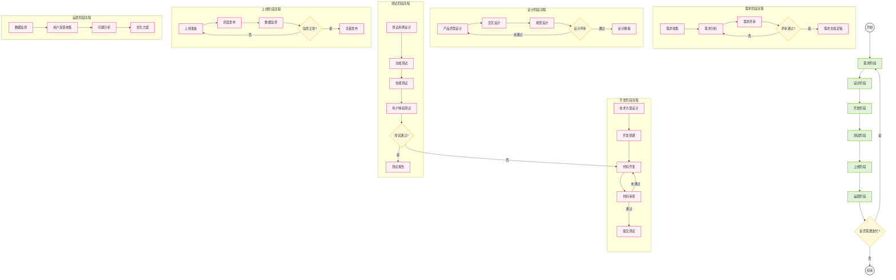

# 产品学习路线图

## 前言
本文档旨在为产品经理的学习提供清晰的路径指导，帮助有志于从事产品工作的同学更好地规划自己的学习路径。路线图分为基础、进阶和高级三个阶段，每个阶段都有明确的学习目标和具体行动指南。

## 一、基础阶段（1-3个月）

### 1. 产品经理认知

- 产品经理的定义、职责和角色定位
- 产品经理的工作内容和日常
- 产品经理需要具备的核心能力
- 产品经理的职业发展路径
- 学习资源：
  - 《产品经理的第一本书》
  - 《人人都是产品经理》
  - 《产品经理实战手册》

### 2. 产品开发流程

#### 2.1 产品开发主要阶段

#### 2.2 产品开发详细流程

- 产品生命周期管理
- 产品开发流程（需求收集、分析、设计、开发、测试、上线）
- 产品文档规范
- 产品评审流程
- 实践任务：
  - 绘制一个完整的产品开发流程图
  - 编写一份产品需求文档（PRD）
  - 参与一次产品评审会议

### 3. 基础工具使用

- 原型设计工具
  - Axure RP（基础功能掌握）
  - Figma（界面设计）
  - 墨刀（快速原型）
- 文档协作工具
  - 飞书文档
  - 腾讯文档
- 项目管理工具
  - JIRA
  - Trello
- 实践任务：
  - 使用Axure完成一个简单的产品原型
  - 使用Figma设计一个产品界面
  - 在JIRA中创建和管理一个项目

## 二、进阶阶段（3-6个月）

### 1. 需求分析能力

- 需求收集方法
  - 用户访谈
  - 问卷调查
  - 数据分析
  - 竞品分析
- 需求分析方法
  - 5W2H分析法
  - 用户故事地图
  - 用户旅程地图
- 需求优先级评估
  - KANO模型
  - MoSCoW方法
- 实践任务：
  - 完成一次用户访谈并整理报告
  - 设计一份用户调查问卷
  - 使用KANO模型对需求进行优先级排序

### 2. 数据分析能力

- 数据分析基础
  - 数据指标定义
  - 数据采集方法
  - 数据分析工具
- 常用数据分析方法
  - 漏斗分析
  - 用户行为分析
  - A/B测试
- 数据可视化
  - 数据图表选择
  - 数据展示技巧
- 实践任务：
  - 使用Excel完成一次数据分析
  - 设计一个A/B测试方案
  - 制作一份数据可视化报告

### 3. 产品设计能力

- 用户体验设计
  - 用户研究
  - 交互设计
  - 视觉设计
- 信息架构
  - 产品结构设计
  - 导航设计
  - 内容组织
- 产品原型设计
  - 低保真原型
  - 高保真原型
  - 交互原型
- 实践任务：
  - 完成一个产品的信息架构设计
  - 设计一个产品的完整交互流程
  - 制作一个高保真产品原型

## 三、高级阶段（6-12个月）

### 1. 产品战略

- 产品战略规划
  - 市场分析
  - 竞品分析
  - 商业模式分析
- 产品定位
  - 目标用户定义
  - 价值主张
  - 差异化策略
- 产品路线图
  - 短期规划
  - 中期规划
  - 长期规划
- 实践任务：
  - 制定一个产品的战略规划
  - 完成一个产品的定位分析
  - 设计一个产品的路线图

### 2. 项目管理

- 项目规划
  - 项目范围定义
  - 时间规划
  - 资源分配
- 项目执行
  - 进度管理
  - 风险管理
  - 质量管理
- 项目收尾
  - 项目评估
  - 经验总结
  - 文档归档
- 实践任务：
  - 参与一个完整的产品项目
  - 编写项目计划书
  - 进行项目复盘

### 3. 商业分析

- 商业模式分析
  - 商业模式画布
  - 收入模式分析
  - 成本结构分析
- 市场分析
  - 市场规模分析
  - 市场趋势分析
  - 竞争格局分析
- 财务分析
  - 收入预测
  - 成本估算
  - ROI分析
- 实践任务：
  - 完成一个产品的商业模式分析
  - 进行市场调研并撰写报告
  - 制作财务预测模型

## 四、持续学习

### 1. 知识更新

- 关注行业动态
  - 订阅产品相关公众号
  - 参加行业会议
  - 阅读行业报告
- 学习新技术
  - 了解新技术趋势
  - 学习新技术应用
  - 评估技术影响

### 2. 实践积累
- 参与实际项目
- 建立个人作品集
- 分享经验教训

### 3. 人脉建设
- 加入产品经理社群
- 参与行业交流活动
- 建立专业社交网络

## 五、学习资源

### 1. 书籍推荐

- 入门书籍
  - 《人人都是产品经理》
  - 《产品经理的第一本书》
  - 《产品经理实战手册》
- 进阶书籍
  - 《用户体验要素》
  - 《启示录》
  - 《产品经理手册》
- 高级书籍
  - 《商业模式新生代》
  - 《精益创业》
  - 《增长黑客》

### 2. 在线课程
- 产品经理入门课程
- 产品设计实战课程
- 数据分析课程
- 项目管理课程

### 3. 工具推荐
- 原型设计：Axure、Figma、墨刀
- 数据分析：Excel、SQL、Python
- 项目管理：JIRA、Trello、飞书
- 文档协作：飞书文档、腾讯文档

## 六、时间规划

### 1. 每日学习计划

| 时间段 | 学习内容 | 时长 | 具体安排 |
|--------|----------|------|----------|
| 早晨 | 阅读文章 | 30分钟 | - 浏览产品相关公众号 - 阅读行业新闻 - 整理重要信息 |
| 中午 | 在线课程 | 1小时 | - 观看视频课程 - 完成课后练习 - 整理笔记 |
| 晚上 | 实践练习 | 2小时 | - 完成实践任务 - 项目实战 - 复盘总结 |

### 2. 每周学习计划
- 周一至周五：按计划学习
- 周六：总结和复习
- 周日：实践项目

### 3. 每月学习计划
- 第一周：基础知识学习
- 第二周：技能实践
- 第三周：项目实战
- 第四周：总结复盘

## 结语
产品经理是一个需要持续学习和实践的岗位，这个学习路线图提供了一个系统的学习框架。建议根据个人情况和实际需求调整学习计划，保持学习的持续性和实践性。记住，理论结合实践，才能更好地成长。
