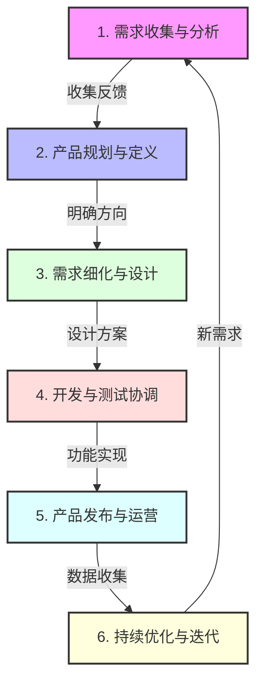

# 如何成为一个好的产品经理

::: tip 导读
本文将从产品经理的定义出发，深入探讨产品经理的角色定位、必备能力、学习路径以及评估标准，帮助你全面了解如何成为一名优秀的产品经理。
:::

## 什么是产品经理？

产品经理（Product Manager，简称PM）是一个负责产品全生命周期的角色，从产品的构思、规划、开发到上市后的持续优化。产品经理需要平衡用户需求、商业目标和团队资源，确保产品能够为用户创造价值，同时为公司带来收益。

::: info 产品经理的核心职责

- 产品战略规划
- 需求分析与管理
- 产品设计与优化
- 跨团队协作
- 数据分析与决策
  :::

## 为什么需要产品经理？

### 1. 需求整合者

产品经理负责收集、分析和整合来自用户、市场、业务团队等各方面的需求，确保产品方向正确。

### 2. 决策制定者

在资源有限的情况下，产品经理需要做出优先级判断，决定做什么、不做什么。

### 3. 跨部门协调者

产品经理需要与设计、开发、运营、市场等多个团队协作，确保产品顺利落地。

::: info 产品经理 vs 项目经理
| | 产品经理 | 项目经理 |
| --- | --- | --- |
| 关注点 | **价值创造** | **执行交付** |
| 协调目的 | 确保产品方向正确，功能满足用户需求 | 确保项目按时、按质、按预算完成 |
| 考虑方向 | "做正确的事" | "正确地做事" |
| 协调性质 | 持续性的产品生命周期管理 | 阶段性的项目目标达成 |
:::

### 4. 价值创造者

通过深入理解用户需求和市场机会，产品经理帮助公司创造可持续的商业价值。

## 产品经理的工作流程

### 1. 需求收集与分析

- 用户调研与访谈
- 数据分析与洞察
- 市场趋势研究
- 竞品分析
- 内部需求收集

### 2. 产品规划与定义

- 制定产品策略
- 确定产品愿景
- 设定产品目标
- 制定产品路线图
- 进行可行性评估

### 3. 需求细化与设计

- 编写产品需求文档(PRD)
- 设计用户故事
- 制作产品原型
- 定义产品功能
- 确定优先级排序

### 4. 开发与测试协调

- 与研发团队对齐需求
- 跟进开发进度
- 协调测试资源
- 验证功能实现
- 处理开发过程中的问题

### 5. 产品发布与运营

- 制定发布计划
- 准备上线材料
- 培训相关团队
- 监控产品数据
- 收集用户反馈

### 6. 持续优化与迭代

- 分析产品数据
- 评估产品表现
- 收集改进建议
- 规划迭代方向
- 持续产品优化

## 产品经理的交付物

::: tabs
@tab 产品规划阶段

- 产品战略文档
- 产品路线图
- 市场分析报告
- 竞品分析报告

@tab 产品设计阶段

- 产品需求文档（PRD）
- 用户故事
- 产品原型
- 交互设计文档

@tab 产品开发阶段

- 功能规格说明
- 开发任务清单
- 测试用例
- 上线计划

@tab 产品运营阶段

- 数据分析报告
- 用户反馈分析
- 产品优化方案
- 运营策略文档
  :::

## 如何评估产品经理是否合格

### 产品成果

- 产品是否满足用户需求
- 产品是否达到商业目标
- 产品是否持续优化改进

### 团队协作

- 是否有效协调各方资源
- 是否建立良好的团队氛围
- 是否推动团队持续进步

### 个人成长

- 是否持续学习新知识
- 是否提升专业能力
- 是否培养领导力

## 结语

成为一名合格的产品经理是一个持续学习和成长的过程。需要不断积累经验，提升能力，在实践中成长。
最重要的是要始终以用户为中心，创造有价值的产品，为公司带来持续的商业价值。
好的产品经理不仅要有过硬的专业能力，更要有同理心和责任感，这样才能真正做好产品，服务好用户。
