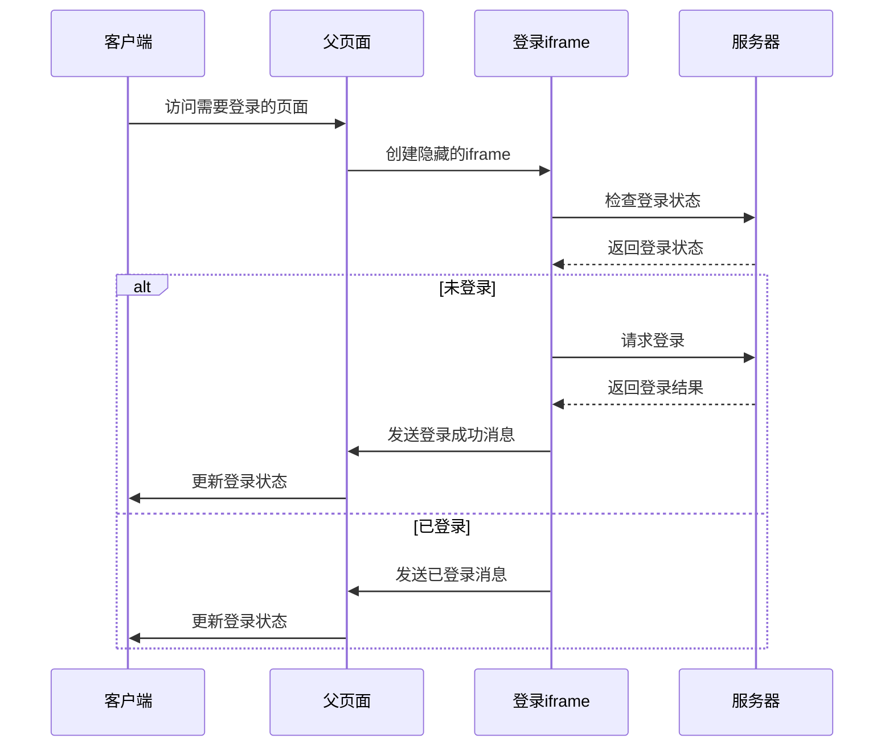

## 如何利用iframe实现无感登录

### 背景
公司想打造生态，开了多条产线，有了在不同的网站或应用之间切换的需求，而每个应用都需要用户重新登录是一件非常繁琐的事情。为了提高用户体验，实现无感登录（Seamless Login）变得越来越重要。无感登录可以让用户在已登录某个应用的情况下，自动完成其他相关应用的登录过程。

### 技术选型
实现无感登录有多种技术方案，我们选择使用 iframe 方案的原因如下：

1. **兼容性好**：
   - iframe 是 HTML 标准元素，所有现代浏览器都支持
   - 不需要依赖特定的框架或库

2. **安全性高**：
   - 可以控制 iframe 的权限和通信方式
   - 支持跨域安全策略（CORS）

3. **实现简单**：
   - 不需要复杂的配置
   - 维护成本低

4. **用户体验好**：
   - 登录过程对用户完全透明
   - 不会打断用户的操作流程

### 技术方案


### 技术实现

#### 1. 父页面实现
```javascript
// 创建隐藏的iframe
const createLoginIframe = () => {
  const iframe = document.createElement('iframe');
  iframe.style.display = 'none';
  iframe.src = 'https://login.example.com/login.html';
  document.body.appendChild(iframe);
  return iframe;
};

// 监听iframe消息
const listenIframeMessage = () => {
  window.addEventListener('message', (event) => {
    // 验证消息来源
    if (event.origin !== 'https://login.example.com') return;
    
    const { type, data } = event.data;
    switch (type) {
      case 'LOGIN_SUCCESS':
        handleLoginSuccess(data);
        break;
      case 'ALREADY_LOGGED_IN':
        handleAlreadyLoggedIn(data);
        break;
      case 'LOGIN_FAILED':
        handleLoginFailed(data);
        break;
    }
  });
};

// 处理登录成功
const handleLoginSuccess = (data) => {
  // 更新本地登录状态
  localStorage.setItem('token', data.token);
  // 更新UI状态
  updateUIState(true);
};

// 处理已登录状态
const handleAlreadyLoggedIn = (data) => {
  // 更新本地登录状态
  localStorage.setItem('token', data.token);
  // 更新UI状态
  updateUIState(true);
};

// 处理登录失败
const handleLoginFailed = (data) => {
  // 显示错误信息
  showErrorMessage(data.message);
  // 更新UI状态
  updateUIState(false);
};
```

#### 2. iframe页面实现
```javascript
// 检查登录状态
const checkLoginStatus = async () => {
  try {
    const response = await fetch('/api/check-login', {
      credentials: 'include' // 包含cookie
    });
    const data = await response.json();
    
    if (data.isLoggedIn) {
      // 已登录，通知父页面
      notifyParent('ALREADY_LOGGED_IN', {
        token: data.token,
        userInfo: data.userInfo
      });
    } else {
      // 未登录，执行登录
      await performLogin();
    }
  } catch (error) {
    notifyParent('LOGIN_FAILED', {
      message: '登录状态检查失败'
    });
  }
};

// 执行登录
const performLogin = async () => {
  try {
    const response = await fetch('/api/login', {
      method: 'POST',
      credentials: 'include',
      headers: {
        'Content-Type': 'application/json'
      },
      body: JSON.stringify({
        // 登录参数
      })
    });
    
    const data = await response.json();
    if (data.success) {
      // 登录成功，通知父页面
      notifyParent('LOGIN_SUCCESS', {
        token: data.token,
        userInfo: data.userInfo
      });
    } else {
      // 登录失败，通知父页面
      notifyParent('LOGIN_FAILED', {
        message: data.message
      });
    }
  } catch (error) {
    notifyParent('LOGIN_FAILED', {
      message: '登录请求失败'
    });
  }
};

// 通知父页面
const notifyParent = (type, data) => {
  window.parent.postMessage({
    type,
    data
  }, '*'); // 实际使用时应该指定具体的origin
};

// 页面加载完成后执行
document.addEventListener('DOMContentLoaded', () => {
  checkLoginStatus();
});
```

#### 3. 服务器端实现
```javascript
// 检查登录状态接口
app.get('/api/check-login', (req, res) => {
  const token = req.cookies.token;
  if (token) {
    // 验证token
    verifyToken(token)
      .then(userInfo => {
        res.json({
          isLoggedIn: true,
          token,
          userInfo
        });
      })
      .catch(() => {
        res.json({
          isLoggedIn: false
        });
      });
  } else {
    res.json({
      isLoggedIn: false
    });
  }
});

// 登录接口
app.post('/api/login', (req, res) => {
  const { username, password } = req.body;
  
  // 验证用户信息
  authenticateUser(username, password)
    .then(userInfo => {
      // 生成token
      const token = generateToken(userInfo);
      
      // 设置cookie
      res.cookie('token', token, {
        httpOnly: true,
        secure: true,
        sameSite: 'strict'
      });
      
      res.json({
        success: true,
        token,
        userInfo
      });
    })
    .catch(error => {
      res.json({
        success: false,
        message: error.message
      });
    });
});
```

### 安全考虑

1. **跨域安全**：
   - 使用 `postMessage` 时指定具体的 origin
   - 验证消息来源
   - 配置正确的 CORS 策略

2. **Cookie 安全**：
   - 使用 `httpOnly` 防止 XSS 攻击
   - 使用 `secure` 确保只在 HTTPS 下传输
   - 使用 `sameSite` 防止 CSRF 攻击

3. **Token 安全**：
   - 使用 JWT 等安全的 token 格式
   - 设置合适的过期时间
   - 实现 token 刷新机制

### 注意事项

1. **性能优化**：
   - iframe 加载可能影响页面性能
   - 考虑使用延迟加载
   - 及时清理不需要的 iframe

2. **用户体验**：
   - 处理加载失败的情况
   - 提供合适的错误提示
   - 考虑降级方案

3. **兼容性**：
   - 测试不同浏览器的表现
   - 处理移动端适配
   - 考虑禁用 iframe 的情况

### 总结
使用 iframe 实现无感登录是一个相对简单且有效的方案。通过合理的设计和实现，可以在保证安全性的同时提供良好的用户体验。在实际应用中，需要根据具体场景选择合适的实现方式，并注意处理各种边界情况。
