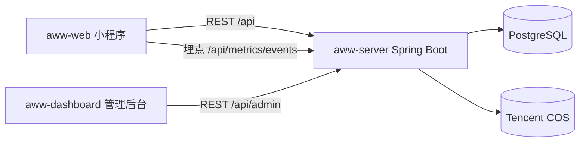

# 爱上迪小程序

从 0 到 1 做一个「迪士尼周边交易小程序」：AWW 技术复盘

> 关键词：微信小程序、Spring Boot、PostgreSQL、JWT、Flyway、腾讯云 COS、运营后台、性能优化

## 1. 背景与目标

AWW（爱上迪/爱上海迪）是一个面向迪士尼周边爱好者的交易与社区平台，产品形态上由三部分组成：

- **小程序端（aww-web）**：面向普通用户的主入口，包含发现/论坛/图鉴/我的、商品详情与发布、私聊、发售日历等。
- **后端服务（aww-server）**：统一的 REST API，承载登录鉴权、商品与交易数据、论坛与聊天、文件上传、埋点与运营统计等。
- **管理后台（aww-dashboard）**：面向运营/管理员，用于管理 SPU/SKU、上传资源、审核/下架交易信息、管理用户与配置、查看埋点汇总。

项目的核心目标不是“功能堆砌”，而是尽快形成闭环：**用户能看到商品 → 能发布求购/出售信息 → 能私聊沟通 → 管理侧可治理内容与维护数据**。在此基础上，再通过性能与工程化迭代降低维护成本。

## 2. 整体架构

从交互视角来看，AWW 的关键链路可以抽象为三条：

1. **登录链路**：小程序 `wx.login()` 获取 `code` → 后端调用微信 `code2Session` 换 `openid/session_key` → 绑定/创建用户 → 签发 JWT。
2. **内容链路**：SPU/SKU 由管理后台维护 → 小程序端展示并承接“发布/收藏/拥有/价格信息”等。
3. **交易链路**：小程序发布 BUY/SELL → 后端校验 SKU 与价格区间 → 生成/覆盖 ACTIVE 报价 → 管理后台可下架并发系统消息 → 用户在消息中心感知治理结果。

### 2.1 端到端组件关系



### 2.2 技术栈选择的理由

- **后端：Spring Boot + JPA + Flyway**
  - 对 CRUD 型业务与权限管控足够高效，心智负担低。
  - Flyway 迁移适合“持续演进的表结构”，可追溯与可回滚的工程体验明显优于手工改表。
- **数据：PostgreSQL**
  - 对 JSONB、索引、聚合等能力友好，能支撑后续搜索与统计类需求。
- **鉴权：JWT**
  - 小程序天然是无状态调用，JWT 能减少服务端会话复杂度，并能在管理后台与小程序端复用同一套认证框架。
- **对象存储：腾讯云 COS**
  - 图片/资源托管与 CDN 天然适配，能避免本地磁盘存储带来的扩容、备份与权限问题。
- **管理后台：Vue 3 + TypeScript + Element Plus + Vite**
  - 快速落地列表/表单/上传等常见运营界面；Vite 开发体验好，构建产物可控。
- **小程序：原生 + TypeScript**
  - 直接对齐微信端能力，减少额外框架层带来的不确定性；同时通过类型系统降低线上回归风险。

## 3. 后端关键设计与实现

### 3.1 统一鉴权：小程序登录 + 管理员登录共用 JWT

后端有两类身份：

- **普通用户**：小程序端通过 `/api/users/login` 登录，返回 `token/userInfo`。
- **管理员**：后台通过 `/api/admin/login` 登录，用于写操作与治理能力。

项目的关键点在于：两类身份**共享同一个 JWT 方案**，但对应不同的数据库表。为了避免“同一个 subject 在不同表中碰撞导致角色识别错误”，鉴权过滤器做了按路径优先级的识别策略（在管理相关路径上优先按管理员解析）：

核心代码（节选）来自 `aww-server/src/main/java/com/aww/server/security/JwtAuthenticationFilter.java` 与 `aww-server/src/main/java/com/aww/server/config/SecurityConfig.java`：

```java
String uri = request.getRequestURI();
boolean preferAdminFirst = uri.startsWith("/api/admin") || uri.startsWith("/api/uploads");

Optional<?> userOptional = Optional.empty();
if (preferAdminFirst) {
    userOptional = adminService.getAdminById(userId);
    if (userOptional.isEmpty()) {
        userOptional = userService.findById(userId);
    }
} else {
    userOptional = userService.findById(userId);
    if (userOptional.isEmpty()) {
        userOptional = adminService.getAdminById(userId);
    }
}
```

这类问题在多端共用 token 的系统里非常常见：**“身份域”必须明确**。本项目采用“按路径优先级”作为折中解法，后续更稳健的做法是把 `subject` 变成 `admin:{id}` / `user:{id}`，或增加 `role` claim。

### 3.2 小程序登录：静默登录与资料补全的分段流程

小程序常见的体验诉求是“进入即用”，但微信侧用户资料授权又需要用户交互。为此后端把登录分成两段：

1. 仅传 `code`：如果 `openid` 已存在则直接登录；若不存在，返回 `requireProfile=true` 提示前端弹窗补全昵称与头像。
2. 传 `code + userInfo`：创建或更新用户，并签发 token。

核心代码（节选）来自 `aww-server/src/main/java/com/aww/server/controller/UserController.java`：

```java
if (userInfo == null) {
    Optional<User> existing = userService.findByOpenid(openid);
    if (existing.isPresent()) {
        User user = existing.get();
        Map<String, Object> data = new HashMap<>();
        data.put("userId", user.getId());
        data.put("openid", openid);
        data.put("token", tokenProvider.generateToken(user.getId()));
        data.put("userInfo", user);
        return ResponseEntity.ok(Map.of("success", true, "data", data));
    } else {
        Map<String, Object> data = new HashMap<>();
        data.put("requireProfile", true);
        data.put("openid", openid);
        return ResponseEntity.ok(Map.of("success", true, "data", data));
    }
}
```

此设计的收益：

- 首次进入体验更顺滑：能把“授权资料”延后到真正需要的时候。
- 静默登录不会覆盖已有资料：更新逻辑只覆盖非空字段（节选来自 `aww-server/src/main/java/com/aww/server/service/UserService.java`）。

```java
if (existingUser.isPresent()) {
    user = existingUser.get();
    if (nickname != null && !nickname.trim().isEmpty()) {
        user.setNickname(nickname);
    }
    if (avatarUrl != null && !avatarUrl.trim().isEmpty()) {
        user.setAvatarUrl(avatarUrl);
    }
    user.setLastLoginAt(java.time.LocalDateTime.now());
}
```

### 3.3 数据演进：Flyway 迁移 + 序列校准

项目采用 Flyway 维护数据库迁移脚本（`V1__Initial_schema.sql` 起步，后续持续演进），并在应用启动时对用户 ID 序列进行校准以规避历史数据迁移导致的主键冲突：

- 迁移脚本目录：`aww-server/src/main/resources/db/migration/`
- 序列校准逻辑：`aww-server/src/main/java/com/aww/server/config/DatabaseSequenceInitializer.java`

```java
jdbcTemplate.execute(
  "SELECT setval(\n" +
  "  pg_get_serial_sequence('users','id'),\n" +
  "  GREATEST(9999, (SELECT COALESCE(MAX(id),0) FROM users)),\n" +
  "  TRUE\n" +
  ");"
);
```

经验总结：

- 迁移脚本是“事实来源”，文档永远滞后；因此迁移本身的可读性与命名必须长期维护。
- 主键策略一旦更改（例如从低位开始、或做过数据回填），建议显式校准序列，避免上线后出现难以排查的插入失败。

### 3.4 交易发布：价格区间、特殊品类与“覆盖式 Upsert”

交易报价（BUY/SELL）是小程序的核心业务对象之一。这里做了三类约束，保证数据可控：

1. **价格区间校验**：从 SKU 上读取 `limitPriceMin/limitPriceMax` 作为约束，避免离谱报价污染列表与排序。
2. **特殊品类规则**：对“商店名额”等品类采用“折扣/满减双字段”校验，避免被迫用单一价格字段表达复杂报价。
3. **覆盖式 Upsert**：同一用户、同一 SKU、同一类型（BUY/SELL）只允许一条 ACTIVE；新发布会覆盖旧记录，减少重复信息与垃圾数据。

核心代码（节选）来自 `aww-server/src/main/java/com/aww/server/service/TradeOfferService.java`：

```java
Optional<TradeOffer> existingOpt = tradeOfferRepository
    .findFirstBySkuIdAndUserIdAndTypeAndStatus(skuId, userId, type, TradeOffer.Status.ACTIVE);
if (existingOpt.isPresent()) {
    TradeOffer existing = existingOpt.get();
    existing.setPriceAmount(tradeOffer.getPriceAmount());
    existing.setQuantity(tradeOffer.getQuantity());
    existing.setTradeMethod(tradeOffer.getTradeMethod());
    existing.setTradePlace(tradeOffer.getTradePlace());
    existing.setContactType(tradeOffer.getContactType());
    existing.setContactInfo(tradeOffer.getContactInfo());
    return tradeOfferRepository.save(existing);
}
return tradeOfferRepository.save(tradeOffer);
```

这一设计的取舍：

- 优点：列表更干净，用户修改报价的体验更直观；后端也更容易进行“每人每物每类一条”的统计。
- 缺点：丢失历史版本；若未来需要价格走势或行为分析，需要引入审计表或事件流来补足。

### 3.5 管理治理：审核轨迹 + 系统消息通知

治理侧的关键能力包括：检索报价、下架/删除、批量操作、记录审计原因，并把治理结果通过“系统消息”推送给用户。

核心代码（节选）来自 `aww-server/src/main/java/com/aww/server/controller/AdminTradeController.java`（下架后发送系统消息）：

```java
String msg = "您发布的商品《" + title + "》的" + typeCn + "信息已下架"
    + (remark != null && !remark.isBlank() ? ("，原因：" + remark) : "");
chatService.sendMessage(new ChatMessage(sender, offer.getUserId(), msg, ChatMessage.MessageType.SYSTEM));
```

这种“系统消息即聊天消息”的模型，在工程上非常划算：

- 不需要额外维护通知表与消息中心协议。
- 客户端可以复用同一套 UI 与拉取逻辑。

### 3.6 文件存储：COS 统一上传与后台资源管理

图片与资源托管采用腾讯云 COS。后端提供：

- 管理后台的文件列表/关键字过滤/分页
- 单文件上传/批量上传
- 批量删除

核心实现：

- COS 客户端与本地 `.env` 容错加载：`aww-server/src/main/java/com/aww/server/config/CosClientConfig.java`
- 上传与管理接口：`aww-server/src/main/java/com/aww/server/controller/UploadsController.java`
- COS 访问与对象操作封装：`aww-server/src/main/java/com/aww/server/service/CosService.java`

核心代码（节选）来自 `CosService`（避免桶名缺失导致的隐式失败）：

```java
private String requireBucket() {
    String b = bucket();
    if (b.isBlank()) {
        throw new IllegalArgumentException("未配置 COS 存储桶：请设置环境变量 TENCENT_COS_BUCKET");
    }
    return b;
}
```

经验总结：对象存储一定要把 **bucket / baseUrl / region** 等配置从代码里抽离到环境变量，避免配置漂移与泄露风险。

### 3.7 埋点与运营统计：事件模型 + 管理侧汇总

项目实现了一套轻量级的事件上报与汇总能力：

- 小程序端上报：`POST /api/metrics/events`
- 管理侧汇总：`GET /api/admin/metrics/summary`

核心代码（节选）来自 `aww-server/src/main/java/com/aww/server/controller/MetricsController.java`：

```java
AppEvent ev = new AppEvent(uid, req.eventType.trim(), req.page, req.refId, meta);
appEventRepository.save(ev);
return ResponseEntity.ok(Map.of("success", true));
```

这种“先把数据记下来，再做分析”的策略适合 0→1 阶段：先让闭环跑起来，统计口径可以后置迭代。

## 4. 管理后台与小程序端：工程化与性能优化

### 4.1 管理后台：构建产物可控、按需引入 UI

管理后台基于 Vue3 + TS + Element Plus，并通过构建策略降低首包体积与提升缓存命中：

- 按需自动引入 Element Plus 组件与样式（减少整库打包）
- Rollup 手动分包（vue/axios/icons）
- 仅开发环境启用 devtools 插件
- 开发期通过 Vite proxy 直连本地后端 `/api`

参考配置：`aww-dashboard/vite.config.ts`（构建分包 + Element Plus 按需引入）

### 4.2 小程序性能：按需注入与构建配置收敛

小程序侧采用了微信推荐的性能策略：

- `lazyCodeLoading: "requiredComponents"` 开启按需注入
- `minifyWXSS/minifyWXML` 等压缩配置
- `uploadWithSourceMap: false` 降低构建产物体积
- `lazyloadPlaceholderEnable: true` 提升懒加载体验

配置入口：`aww-web/project.config.json`

另有一次集中性的代码质量优化复盘记录（包括调试语句清理与页面配置完善）：`docs/CODE_OPTIMIZATION_REPORT.md`

## 5. 复盘：做对了什么、踩过哪些坑

### 5.1 做对了什么

1. **闭环优先**：先把“商品—报价—沟通—治理”跑通，再做体验与性能优化。
2. **沟通至上**：在项目初期，我强调“沟通是项目成功的基础”。我会与合作人频繁沟通，分享项目进度、技术难题、解决方案。我也会主动监听合作人反馈，及时调整项目方向。
3. **工程化逐步收敛**：后台按需引入与分包，小程序按需注入与压缩，属于“低成本高收益”的优化。

### 5.2 真实踩坑与经验教训

1. **数据库备份**

   - 问题本质：数据库前期没有备份，合作人自己导数据没有跟我说，导致中间丢失了20多条报价数据。
   - 经验：数据库一定要建立备份，不要依赖于人工。开发环境和生产环境可以的话尽量分开。

2. **与人合作的目的性**

   - 合作的朋友大概是失业以后想转型，但是缺乏市场认可的完善的作品，所以最终我也只象征性拿了3000元。
   - 经验：如果只是为了学习，就不要在乎报酬。如果为了钱，就不要随便放下自己的身段。后续不随便接单，提高自己的客单价！

3. **需求理解与实现细节**
   - 问题本质：前期虽然准备了大量工作去理解项目需求，但是中间关于商品报价的功能细节还是有误差，首先他的产品稿子并非高保真，没有UI，其次我对这块业务理解也不透彻，导致在实现过程中出现了一些偏差。
   - 经验：确保理解一致的最好办法。是基于原型的复述。

## 6. 题外话

这是我参与设计的第一个闭环的项目，从前端的小程序、后台管理系统，到java后端、数据库、存储桶、部署、测试、接口文档，实现了我自认为还算满意的闭环。虽然最后因为大环境又变差了没有上线，但是对于我对整体项目的设计实现，尤其是后端开发过程中会遇到的细节流程，还是有很多收获的。

---
