::: tip 导读
本文将带你梳理AI发展的关键脉络，重点解析LLM、Agent、MCP和Workflow四个核心概念，通过生动的比喻和实例帮助你理解它们之间的关系与区别。
:::

## 一、AI发展时间轴

::: info 历史回顾
从1950年至今，AI经历了从理论到实践、从实验室到现实世界的跨越式发展。
:::

### 1. 早期探索（1950-2010）

<b>🌱 萌芽期（1950-1980）</b>

- 1950年：图灵测试提出
- 1956年：达特茅斯会议，AI概念正式诞生
- 1960年代：专家系统兴起
- 1970年代：AI第一次寒冬

<b>🌿 复兴期（1980-2000）</b>

- 1980年代：机器学习算法发展
- 1997年：IBM深蓝击败国际象棋冠军
- 1990年代：神经网络研究复苏

<b>🌳 快速发展期（2000-2010）</b>

- 2006年：深度学习概念提出
- 2009年：ImageNet数据集发布
- 2010年代：GPU加速深度学习训练

### 2. 现代AI时代（2010-2020）

::: note 爆发期特征
这个阶段见证了深度学习的爆发式增长，奠定了大模型时代的基础。
:::

- 2012年：AlexNet在ImageNet竞赛中获胜 `计算机视觉革命`
- 2014年：GAN（生成对抗网络）提出 `生成式AI元年`
- 2017年：Transformer架构提出 `NLP革命性突破`
- 2018年：BERT模型发布 `预训练模型时代开启`

### 3. 大模型时代（2020至今）

::: warning 重要时期
这是AI发展的关键转折点，标志着AI真正走向实用化、大众化的新纪元。
:::

```mermaid
graph TD
    %% 2020年
    A1[2020年] --> A2[GPT-3发布]
    A2 --> A3[1750亿参数]
    A2 --> A4[Few-shot学习]
    A2 --> A5[通用能力突破]

    %% 2021年
    B1[2021年] --> B2[Codex发布]
    B2 --> B3[代码生成]
    B2 --> B4[GitHub Copilot]
    B1 --> B5[CLIP]
    B5 --> B6[多模态理解]

    %% 2022年
    C1[2022年] --> C2[ChatGPT发布]
    C2 --> C3[对话式交互]
    C2 --> C4[指令微调]
    C1 --> C5[Stable Diffusion]
    C5 --> C6[图像生成]

    %% 2023年
    D1[2023年] --> D2[GPT-4发布]
    D2 --> D3[多模态能力]
    D2 --> D4[更强的推理]
    D1 --> D5[Claude 2]
    D5 --> D6[长文本处理]
    D1 --> D7[AutoGPT]
    D7 --> D8[Agent概念]
    D1 --> D9[LangChain]
    D9 --> D10[Workflow框架]

    %% 2024年
    E1[2024年] --> E2[Gemini发布]
    E2 --> E3[多模态统一]
    E1 --> E4[Agent框架]
    E4 --> E5[任务分解]
    E4 --> E6[工具使用]
    E1 --> E7[MCP系统]
    E7 --> E8[团队协作]
    E1 --> E9[Workflow引擎]
    E9 --> E10[自动化编排]

    %% 样式设置
    classDef year fill:#f0f0f0,stroke:#666,stroke-width:2px
    classDef milestone fill:#4CAF50,stroke:#2E7D32,stroke-width:2px,color:white
    classDef feature fill:#2196F3,stroke:#1565C0,stroke-width:2px,color:white

    class A1,B1,C1,D1,E1 year
    class A2,B2,B5,C2,C5,D2,D5,D7,D9,E2,E4,E7,E9 milestone
    class A3,A4,A5,B3,B4,B6,C3,C4,C6,D3,D4,D6,D8,D10,E3,E5,E6,E8,E10 feature
```

#### 2020年：通用大模型的诞生
- **GPT-3的革命性突破**
  - 1750亿参数规模，开创超大规模语言模型时代
  - 首次展现出Few-shot学习能力，无需微调即可适应新任务
  - 通用能力显著提升，可完成写作、翻译、编程等多样化任务
- 技术积累
  - Transformer架构的深度优化
  - 预训练-微调范式的成熟

#### 2022年：AI民主化元年
- **ChatGPT引发行业变革**
  - 对话式交互模式重新定义了人机交互方式
  - 指令微调（InstructGPT）大幅提升模型可控性
  - 首次实现大规模商业化应用，AI走入普通用户生活
- 图像生成领域突破
  - Stable Diffusion开源，降低AI创作门槛
  - 文本生成图像技术走向成熟

#### 2023年：多模态与智能体崛起
- **GPT-4的全面进化**
  - 多模态理解能力实现质的飞跃
  - 推理能力显著增强，接近人类专家水平
  - 安全性和可控性大幅提升
- **智能体技术的突破**
  - AutoGPT开创自主Agent范式
  - Claude 2突破长文本处理限制
  - LangChain确立Workflow开发框架标准
- 技术生态的繁荣
  - 开源社区蓬勃发展
  - 应用场景快速扩展
  - 商业化落地加速

#### 2024年：协作智能新纪元
- **多智能体协作（MCP）的兴起**
  - 从单体Agent向多智能体协作演进
  - 复杂任务分解与团队协作能力提升
  - 动态角色分配与协商机制成熟
- **Workflow的深度进化**
  - 自动化编排能力增强
  - 跨模态任务流程整合
  - 错误处理与自优化机制完善
- **Gemini展现全新范式**
  - 多模态统一架构
  - 原生多模态训练
  - 更强的跨模态理解与生成能力

::: tip 质变突破
1. 💡 **交互范式革命**：从单向输出到对话式交互
2. 🚀 **能力边界扩展**：从特定任务到通用智能
3. 🤝 **协作模式进化**：从单体智能到群体智能
4. 🌍 **应用场景裂变**：从实验室到真实世界
5. 🔄 **技术架构升级**：从单模态到多模态统一
:::

## 二、核心概念解析

::: info 概念图解
通过类比和实例，帮助你理解AI世界的核心概念。
:::

| 概念               | 定义                           | 特点                                                                   | 应用场景                                                                 |
| ------------------ | ------------------------------ | ---------------------------------------------------------------------- | ------------------------------------------------------------------------ |
| LLM (大语言模型)   | 基于海量文本训练的深度学习模型 | - 强大的文本理解和生成能力 - 知识储备丰富 - 可进行多轮对话       | - 智能客服 - 内容创作 - 代码生成 - 知识问答                     |
| Agent (智能体)     | 具有自主决策和执行能力的AI系统 | - 可自主规划任务 - 能使用工具 - 可进行多步推理 - 具备记忆能力 | - 个人助手 - 自动化工作流 - 复杂任务处理 - 多系统集成           |
| MCP (多智能体协作) | 多个Agent协同工作的系统        | - 分布式决策 - 角色分工 - 协作优化 - 动态调整                 | - 复杂项目管理 - 多系统集成 - 大规模任务处理 - 团队协作模拟     |
| Workflow (工作流)  | 自动化任务编排和执行系统       | - 可视化流程设计 - 条件分支控制 - 错误处理机制 - 状态追踪管理 | - 业务流程自动化 - 数据处理流水线 - 系统集成编排 - 复杂任务调度 |

### 1. 形象类比：AI公司的组织结构

::: tip 通俗易懂的比喻
想象一个AI公司的运作方式，帮助理解这些概念之间的关系。
:::

如果把AI系统比作一个公司：

- **LLM** 就像是公司的"智囊团"，负责提供知识和建议，但只能"说"不能"做"
- **Agent** 就像是公司的"员工"，不仅能出主意，还能实际执行任务
- **MCP** 就像是公司的"部门"，由多个员工（Agent）组成，通过协作完成复杂项目
- **Workflow** 就像是公司的"管理制度"，规定了工作流程、任务分配和进度追踪

它们之间的关系是层层递进的：

1. LLM提供基础智能
2. Agent赋予执行能力
3. MCP实现团队协作
4. Workflow确保流程规范

就像盖房子：

- LLM是设计图纸（知道怎么盖）
- Agent是建筑工人（能实际施工）
- MCP是施工队（多人协作）
- Workflow是施工计划（确保按部就班）

### 2. 实战场景：智能建筑项目

::: note 实例解析
通过一个具体的建筑项目，展示各个概念在实际应用中的角色。
:::

假设要完成一个软件开发项目：

- Workflow负责：
  - 定义开发流程（需求→设计→编码→测试→部署）
  - 设置任务依赖关系
  - 制定质量检查点
  - 监控进度和状态
- MCP负责：
  - 组建开发团队（多个Agent）
  - 分配具体任务
  - 协调成员协作
  - 处理突发情况

## 三、技术展望

::: info 未来趋势
AI技术正在向着更智能、更实用的方向发展。
:::

1. **技术融合**

   - LLM作为基础能力
   - Agent提供执行能力
   - MCP实现复杂协作
   - Workflow实现流程自动化

2. **应用场景扩展**

   - 从单一任务到复杂工作流
   - 从个人助手到团队协作
   - 从文本处理到多模态交互
   - 从手动操作到自动化流程

3. **能力提升**
   - 更强的推理能力
   - 更准确的决策能力
   - 更自然的协作能力
   - 更智能的流程编排

## 总结与思考

::: tip 核心要点
1. AI发展已进入智能协作新阶段
2. 各类技术正在深度融合
3. 应用场景不断扩展
4. 未来将更加注重实用性和可控性
:::

::: warning 未来挑战
1. 如何确保AI系统的可控性？
2. 如何平衡效率与安全？
3. 如何促进技术与应用的深度融合？
4. AI对社会岗位的冲击不可避免，普通人在AI这块的出路可能只在垂类应用（好的idea）和卖课了
:::

## 参考资料
1. OpenAI官方博客
2. DeepMind研究报告
3. 《The Age of AI》
4. LangChain官方文档
